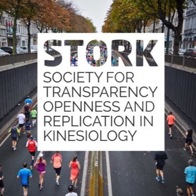

            
The Sports Science Replication Centre is supported by an **advisory board** of researchers who are involved in open science across different fields e.g. Psychology, Exercise Physiology and Biomechanics. The advisory board provides expertise and guidance during the creation of new protocols for the centre.

The centre is also supported by the [**Society for Transparency, Openness and Replication in Kinesiology**](https://www.storkin.org) (STORK). The Sports Science Replication Centre and STORK are both committed to improving the research quality and transparency of conducting research in the field. Full information on their mission statement and details of how to become a member are available on their website.